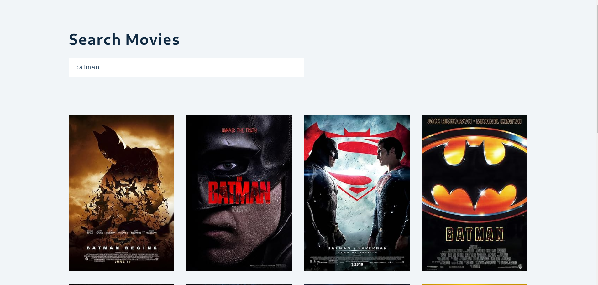
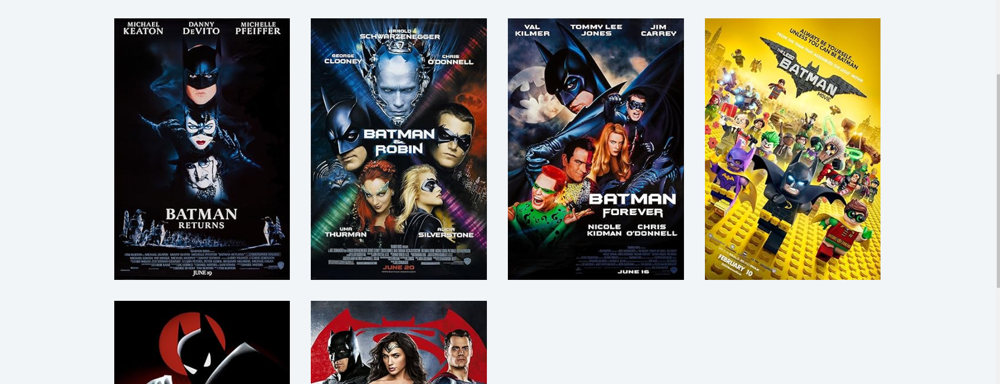
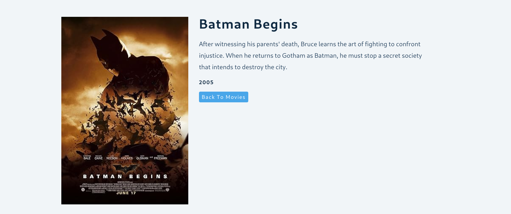

# Movie DB

[Movie DB Live](https://react-movies-db-project.netlify.app/)

```sh
npm install react-router-dom@6
```

#### Movies





#### Single Movie



---

## Languages and Tools are used 🗣️🔧

1. **Languages** 🗣️

   - [HTML](https://github.com/topics/html)
   - [HTML5](https://github.com/topics/html5)
   - [CSS](https://github.com/topics/css)
   - [CSS3](https://github.com/topics/css3)
